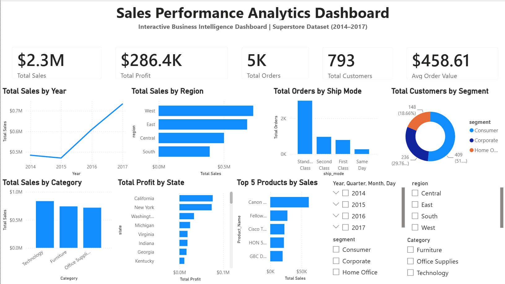
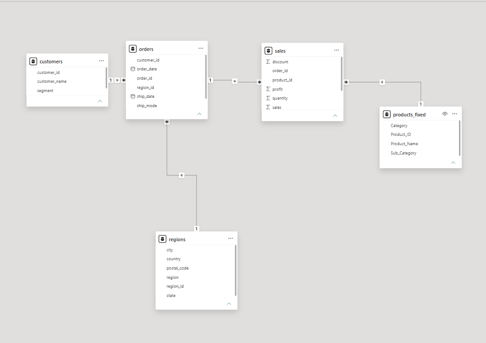

<style>
@import url('https://fonts.googleapis.com/css2?family=Inter:wght@400;600;700&family=Fira+Code:wght@400;500&display=swap');

* { box-sizing: border-box; }

body {
    font-family: 'Inter', -apple-system, BlinkMacSystemFont, "Segoe UI", sans-serif;
    line-height: 1.75;
    color: #1e293b;
    max-width: 900px;
    margin: 0 auto;
    padding: 40px 36px;
    background: #ffffff;
}

h1 {
    font-size: 2.4em;
    font-weight: 700;
    color: #0f172a;
    text-align: center;
    border-bottom: 4px solid #1a4f9c;
    padding-bottom: 14px;
    margin-bottom: 6px;
    letter-spacing: -0.5px;
}
h2 {
    font-size: 1.55em;
    font-weight: 700;
    color: #1a4f9c;
    border-left: 5px solid #1a4f9c;
    padding-left: 14px;
    margin-top: 48px;
    margin-bottom: 16px;
}
h3 {
    font-size: 1.15em;
    font-weight: 600;
    color: #1e293b;
    margin-top: 28px;
    margin-bottom: 10px;
}
h4 {
    font-size: 1em;
    font-weight: 600;
    color: #475569;
    text-transform: uppercase;
    letter-spacing: 0.6px;
    margin-top: 20px;
    margin-bottom: 8px;
}

hr {
    border: none;
    border-top: 1px solid #e2e8f0;
    margin: 40px 0;
}

code {
    font-family: 'Fira Code', 'SFMono-Regular', Consolas, monospace;
    background: #f1f5f9;
    color: #be185d;
    padding: 2px 7px;
    border-radius: 5px;
    font-size: 0.875em;
}

pre {
    background: #0f172a;
    color: #e2e8f0;
    border-radius: 10px;
    padding: 22px 24px;
    overflow-x: auto;
    margin: 18px 0;
    border-left: 4px solid #1a4f9c;
    box-shadow: 0 4px 14px rgba(0,0,0,0.15);
    page-break-inside: avoid;
}
pre code {
    background: transparent;
    color: #e2e8f0;
    padding: 0;
    font-size: 0.83em;
    line-height: 1.7;
}

table {
    width: 100%;
    border-collapse: collapse;
    margin: 24px 0;
    font-size: 0.93em;
    page-break-inside: avoid;
    border-radius: 8px;
    overflow: hidden;
    box-shadow: 0 1px 6px rgba(0,0,0,0.07);
}
thead tr {
    background: #1a4f9c;
    color: #ffffff;
}
th {
    padding: 13px 16px;
    font-weight: 600;
    text-align: left;
    letter-spacing: 0.3px;
}
td {
    padding: 11px 16px;
    border-bottom: 1px solid #e2e8f0;
    color: #334155;
}
tr:nth-child(even) td { background: #f8fafc; }
tr:last-child td { border-bottom: none; }

blockquote {
    margin: 24px 0;
    padding: 16px 20px;
    border-left: 5px solid #1a4f9c;
    background: #eff6ff;
    border-radius: 0 8px 8px 0;
    color: #1e40af;
    font-style: normal;
    page-break-inside: avoid;
}

ul, ol { padding-left: 24px; margin: 10px 0; }
li { margin-bottom: 6px; }
li strong { color: #1e293b; }

pre, table, blockquote { page-break-inside: avoid; }
h2, h3 { page-break-after: avoid; }
</style>

---

# 📊 Sales Performance Analytics

> An end-to-end Business Intelligence & Data Engineering project — raw retail data transformed into a normalized MySQL database, 30 SQL analytics queries, and an interactive Power BI dashboard.

**Stack:** MySQL 8.0+ · Python (Pandas) · SQL · Power BI Desktop · Git

---

## 🔍 Project Overview

Transactional data in corporate environments is often stored in wide, flat CSV files — bloated with redundancy and impossible to query efficiently. This project solves that with a complete **ETL pipeline** followed by deep analytics and visual intelligence on the classic **Superstore Sales Dataset (2014–2017, ~9,994 rows)**.

---

## 🛠 Tech Stack

| Layer | Technology | Role |
| :--- | :--- | :--- |
| **Database** | MySQL 8.0+ | Schema design, constraint enforcement, query execution |
| **ETL & Preprocessing** | Python (Pandas) | Text stripping, date formatting, duplicate removal |
| **Analytics** | SQL (30 Queries) | Window functions, CTEs, LAG, aggregations, subqueries |
| **Visualization** | Power BI Desktop | Star schema modeling, DAX measures, interactive dashboards |
| **Version Control** | Git / GitHub | Commit history, portfolio deployment |

---

## ⚙️ Pipeline Architecture

```text
  [EXTRACT]         [TRANSFORM]         [LOAD]              [ANALYZE]         [VISUALIZE]
  Raw CSV/Excel  →  Python/Pandas    →  MySQL Staging    →  30 SQL Queries →  Power BI
                    Strip/Format        → Normalized                           Dashboards
```

**Stage 1 · Extract** — Bulk load CSV into MySQL staging table using `LOAD DATA LOCAL INFILE` (100× faster than row-by-row INSERT).

**Stage 2 · Transform** — Python/Pandas handles three pre-load fixes:
- `.str.strip()` on all ID columns (trailing spaces broke joins silently)
- Date strings converted using `STR_TO_DATE(col, '%Y-%m-%d')`
- Fully duplicate rows removed

**Stage 3 · Load (ETL SQL Ingestion Scripts)** — Five `INSERT INTO … SELECT` statements migrate clean staging data into the normalized target tables:

```sql
-- 1. Customers
INSERT INTO customers (customer_id, customer_name, segment)
SELECT customer_id, MIN(customer_name), MIN(segment)
FROM superstore_raw GROUP BY customer_id;

-- 2. Products (MIN resolves spelling duplicate PK violations)
INSERT INTO products (product_id, product_name, category, sub_category)
SELECT product_id, MIN(product_name), MIN(category), MIN(sub_category)
FROM superstore_raw GROUP BY product_id;

-- 3. Regions
INSERT INTO regions (country, region, state, city, postal_code)
SELECT DISTINCT country, region, state, city, postal_code
FROM superstore_raw;

-- 4. Orders (STR_TO_DATE casts text strings to proper DATE types)
INSERT INTO orders (order_id, order_date, ship_date, ship_mode, customer_id, region_id)
SELECT DISTINCT
    s.order_id,
    STR_TO_DATE(s.order_date, '%Y-%m-%d'),
    STR_TO_DATE(s.ship_date,  '%Y-%m-%d'),
    s.ship_mode, s.customer_id, r.region_id
FROM superstore_raw s
JOIN regions r
    ON s.country = r.country AND s.region = r.region
    AND s.state  = r.state  AND s.city   = r.city
    AND s.postal_code = r.postal_code;

-- 5. Sales (GROUP BY collapses duplicate composite-key rows)
INSERT INTO sales (order_id, product_id, sales, quantity, discount, profit)
SELECT order_id, product_id,
       SUM(sales), SUM(quantity), AVG(discount), SUM(profit)
FROM superstore_raw
GROUP BY order_id, product_id;
```

> **B-Tree Index Note:** MySQL automatically creates B-Tree indexes on all `PRIMARY KEY` columns. This means joins on `customer_id`, `product_id`, `order_id`, and `region_id` run in **O(log N)** logarithmic time instead of a slow O(N) full table scan — making all analytical queries respond in milliseconds.

**Stage 4 · Analyze** — 30 business queries extract KPIs, trends, rankings, and segment insights.

**Stage 5 · Visualize** — Power BI connects to the MySQL schema and renders an interactive dashboard.

---

## 🗄 Database Schema Design

### Normalization: Flat File → Star Schema (3NF)

The raw `superstore_raw` table suffered from the classic three database anomalies:
- **Insertion Anomaly** — Cannot add a new customer without a purchase.
- **Update Anomaly** — Changing a product name requires updating thousands of rows.
- **Deletion Anomaly** — Deleting an order erases the customer's only profile.

**Solution:** Split into 4 Dimension Tables + 1 Fact Table following 3NF.

### Table Catalog

| Table | Type | Primary Key | Duplicates Policy |
| :--- | :--- | :--- | :--- |
| `customers` | Dimension | `customer_id` — Unique | `customer_name`, `segment` allow duplicates |
| `products` | Dimension | `product_id` — Unique | `product_name`, `category`, `sub_category` allow duplicates |
| `regions` | Dimension | `region_id` — Auto-increment | All geography columns allow duplicates |
| `orders` | Dimension | `order_id` — Unique | `customer_id` FK, `region_id` FK allow duplicates |
| `sales` | **Fact** | `(order_id, product_id)` — Composite PK | Each column individually allows duplicates |

### Entity Relationship Diagram

```text
  customers ──(1:N)──▶ orders ──(1:N)──▶ sales (Fact) ◀──(1:N)── products
  regions   ──(1:N)──▶ orders
```

```text
  ┌──────────────────┐           ┌──────────────────┐
  │    customers     │           │     regions      │
  ├──────────────────┤           ├──────────────────┤
  │ PK customer_id   │           │ PK region_id     │
  │    customer_name │           │    country       │
  │    segment       │           │    region        │
  └────────┬─────────┘           │    state         │
           │ 1:N                 │    city          │
           │                     │    postal_code   │
  ┌────────▼─────────────────────┤                  │
  │          orders              │ 1:N              │
  ├──────────────────────────────┘                  │
  │ PK order_id                  ◀──────────────────┘
  │    order_date, ship_date                         ┌──────────────────┐
  │    ship_mode                                     │     products     │
  │ FK customer_id, region_id                        ├──────────────────┤
  └────────┬─────────┐                               │ PK product_id    │
           │ 1:N     │                           1:N │    product_name  │
  ┌────────▼─────────▼─────────────────────────────▶ │    category      │
  │         sales (Fact)          │                  │    sub_category  │
  ├────────────────────────────────┤                 └──────────────────┘
  │ PK,FK order_id                 │
  │ PK,FK product_id               │
  │       sales, quantity          │
  │       discount, profit         │
  └────────────────────────────────┘
```

---

## 💻 SQL Business Analytics — All 30 Queries

| Tier | Queries | Focus Area |
| :--- | :---: | :--- |
| Financial KPIs | 1–5 | Revenue, profit, AOV, margin % |
| Category & Products | 6–10 | Sales by category, top 10 products |
| Anomaly & Customers | 11–15 | Loss-makers, top customers, segment splits |
| Temporal Trends | 16–20 | Monthly/yearly performance |
| Geography & Discounts | 21–25 | Region/state/city breakdowns |
| Advanced Analytics | 26–30 | Window functions, CTEs, LAG, running totals |

---

### 📊 Tier 1 · Queries 1–5: High-Level Business KPIs

**Query 1: Overall business performance**
```sql
SELECT ROUND(SUM(sales), 2)  AS total_revenue,
       SUM(quantity)          AS total_units_sold,
       ROUND(SUM(profit), 2)  AS total_profit
FROM sales;
```

**Query 2: Database scale (independent subqueries)**
```sql
SELECT (SELECT COUNT(*) FROM customers) AS total_customers,
       (SELECT COUNT(*) FROM products)  AS total_products,
       (SELECT COUNT(*) FROM orders)    AS total_orders;
```

**Query 3 & 4: Average Order Value (AOV) & avg profit per order**
```sql
SELECT ROUND(SUM(sales) / COUNT(DISTINCT order_id), 2) AS average_order_value
FROM sales;
```

**Query 5: Profit margin percentage**
```sql
SELECT ROUND((SUM(profit) / SUM(sales)) * 100, 2) AS profit_margin_percentage
FROM sales;
```

---

### 📦 Tier 2 · Queries 6–10: Category & Product Rankings

**Query 6 & 7: Sales & profit by category / sub-category**
```sql
SELECT p.category,
       ROUND(SUM(s.sales), 2)  AS total_sales,
       ROUND(SUM(s.profit), 2) AS total_profit,
       SUM(s.quantity)         AS units_sold
FROM sales s
JOIN products p ON s.product_id = p.product_id
GROUP BY p.category
ORDER BY total_sales DESC;
```

**Query 8, 9 & 10: Top 10 products by revenue / profit / quantity**
```sql
SELECT p.product_name,
       ROUND(SUM(s.sales), 2) AS total_revenue
FROM sales s
JOIN products p ON s.product_id = p.product_id
GROUP BY p.product_id, p.product_name
ORDER BY total_revenue DESC
LIMIT 10;
```

---

### 📉 Tier 3 · Queries 11–15: Anomaly Checking & Customer Analysis

**Query 11: Identifying loss-making products (HAVING on aggregates)**
```sql
SELECT p.product_name,
       ROUND(SUM(s.profit), 2) AS total_loss
FROM sales s
JOIN products p ON s.product_id = p.product_id
GROUP BY p.product_id, p.product_name
HAVING SUM(s.profit) < 0
ORDER BY total_loss ASC
LIMIT 10;
```

**Query 12: Category contribution to total sales % (nested subquery)**
```sql
SELECT p.category,
       ROUND(SUM(s.sales), 2) AS total_sales,
       ROUND((SUM(s.sales) / (SELECT SUM(sales) FROM sales)) * 100, 2)
                               AS sales_contribution_percent
FROM sales s
JOIN products p ON s.product_id = p.product_id
GROUP BY p.category;
```

**Query 13 & 14: Top 10 customers by revenue / profit (three-table join)**
```sql
SELECT c.customer_name,
       ROUND(SUM(s.sales), 2) AS total_revenue
FROM sales s
JOIN orders   o ON s.order_id    = o.order_id
JOIN customers c ON o.customer_id = c.customer_id
GROUP BY c.customer_id, c.customer_name
ORDER BY total_revenue DESC
LIMIT 10;
```

**Query 15: Customer segment analysis**
```sql
SELECT c.segment,
       ROUND(SUM(s.sales), 2)         AS total_sales,
       COUNT(DISTINCT c.customer_id)  AS total_customers
FROM sales s
JOIN orders    o ON s.order_id    = o.order_id
JOIN customers c ON o.customer_id = c.customer_id
GROUP BY c.segment;
```

---

### 📅 Tier 4 · Queries 16–20: Temporal Trends & Customer Averages

**Query 16: Average revenue per customer**
```sql
SELECT ROUND(SUM(s.sales) / COUNT(DISTINCT c.customer_id), 2) AS avg_revenue_per_customer
FROM sales s
JOIN orders    o ON s.order_id    = o.order_id
JOIN customers c ON o.customer_id = c.customer_id;
```

**Query 17: Top customers by number of orders**
```sql
SELECT c.customer_name,
       COUNT(o.order_id) AS total_orders
FROM orders    o
JOIN customers c ON o.customer_id = c.customer_id
GROUP BY c.customer_id, c.customer_name
ORDER BY total_orders DESC
LIMIT 10;
```

**Query 18, 19 & 20: Yearly & monthly trends (YEAR / MONTH extraction)**
```sql
SELECT YEAR(o.order_date)  AS order_year,
       MONTH(o.order_date) AS order_month,
       ROUND(SUM(s.sales), 2) AS total_sales
FROM orders o
JOIN sales  s ON o.order_id = s.order_id
GROUP BY YEAR(o.order_date), MONTH(o.order_date)
ORDER BY order_year, order_month;
```

---

### 🌍 Tier 5 · Queries 21–25: Geography & Pricing Discounts

**Query 21, 22 & 23: Regional, state & city breakdowns**
```sql
SELECT r.city,
       ROUND(SUM(s.sales), 2)  AS total_sales,
       ROUND(SUM(s.profit), 2) AS total_profit
FROM regions r
JOIN orders o ON o.region_id = r.region_id
JOIN sales  s ON o.order_id  = s.order_id
GROUP BY r.city
ORDER BY total_sales DESC
LIMIT 10;
```

**Query 24: Discount impact on profit**
```sql
SELECT discount,
       ROUND(SUM(sales), 2)  AS total_sales,
       ROUND(SUM(profit), 2) AS total_profit
FROM sales
GROUP BY discount;
```

**Query 25: High-discount products (avg discount ≥ 30%)**
```sql
SELECT p.product_name,
       ROUND(AVG(s.discount), 2) AS avg_discount,
       ROUND(SUM(s.profit), 2)   AS total_profit
FROM products p
JOIN sales s ON p.product_id = s.product_id
GROUP BY p.product_id, p.product_name
HAVING AVG(s.discount) >= 0.30;
```

---

### 🚀 Tier 6 · Queries 26–30: Advanced Window Functions, CTEs & LAG

#### Ranking Functions — Quick Visual Comparison

| Function | Tied Input | Output Ranks | Behavior |
| :--- | :--- | :--- | :--- |
| `ROW_NUMBER()` | A, A, B | 1, 2, 3 | Always unique — no ties |
| `RANK()` | A, A, B | 1, 1, 3 | Ties share rank, skips next number |
| `DENSE_RANK()` | A, A, B | 1, 1, 2 | Ties share rank, does NOT skip |

**Query 26: Cumulative running total sales (SUM OVER)**
```sql
SELECT YEAR(o.order_date)  AS order_year,
       MONTH(o.order_date) AS order_month,
       ROUND(SUM(s.sales), 2) AS monthly_sales,
       ROUND(SUM(SUM(s.sales)) OVER (
           ORDER BY YEAR(o.order_date), MONTH(o.order_date)
       ), 2) AS running_total_sales
FROM orders o
JOIN sales  s ON o.order_id = s.order_id
GROUP BY YEAR(o.order_date), MONTH(o.order_date);
```

**Query 27: Rank all products by total sales (RANK OVER)**
```sql
SELECT p.product_name,
       ROUND(SUM(s.sales)) AS total_sales,
       RANK() OVER (ORDER BY SUM(s.sales) DESC) AS sales_rank
FROM products p
JOIN sales s ON p.product_id = s.product_id
GROUP BY p.product_id, p.product_name;
```

**Query 28: Top product in each category (DENSE_RANK + CTE + PARTITION BY)**
```sql
WITH product_sales AS (
    SELECT p.category,
           p.product_name,
           ROUND(SUM(s.sales), 2) AS total_sales,
           DENSE_RANK() OVER (
               PARTITION BY p.category
               ORDER BY SUM(s.sales) DESC
           ) AS sales_rank
    FROM products p
    JOIN sales s ON p.product_id = s.product_id
    GROUP BY p.category, p.product_id, p.product_name
)
SELECT category, product_name, total_sales
FROM product_sales
WHERE sales_rank = 1;
```

**Query 29: Month-over-Month sales growth (LAG)**
```sql
WITH monthly_sales AS (
    SELECT YEAR(o.order_date)  AS order_year,
           MONTH(o.order_date) AS order_month,
           ROUND(SUM(s.sales), 2) AS total_sales
    FROM orders o
    JOIN sales  s ON o.order_id = s.order_id
    GROUP BY YEAR(o.order_date), MONTH(o.order_date)
)
SELECT order_year,
       order_month,
       total_sales,
       LAG(total_sales) OVER (ORDER BY order_year, order_month) AS previous_month_sales,
       ROUND(total_sales
             - LAG(total_sales) OVER (ORDER BY order_year, order_month), 2) AS sales_difference
FROM monthly_sales
ORDER BY order_year, order_month;
```

**Query 30: Top 10 highest-revenue orders**
```sql
SELECT o.order_id,
       c.customer_name,
       ROUND(SUM(s.sales)) AS total_order_value
FROM orders    o
JOIN customers c ON o.customer_id = c.customer_id
JOIN sales     s ON o.order_id    = s.order_id
GROUP BY o.order_id, c.customer_name
ORDER BY total_order_value DESC
LIMIT 10;
```

---

## 📊 Power BI Model & Dashboard

### Relationships (Star Schema — Single Direction)

- `customers` (1) → (N) `orders`
- `regions` (1) → (N) `orders`
- `orders` (1) → (N) `sales` (Fact)
- `products` (1) → (N) `sales` (Fact)

All filter directions set to **Single (one-directional)** to prevent circular dependency loops and ensure fast model recalculation.

### Import Mode vs DirectQuery

| Mode | How it works | When to use |
| :--- | :--- | :--- |
| **Import Mode** ✅ (what we used) | Power BI copies data into RAM and uses the **VertiPaq columnar compression engine** (up to 10× file size reduction). Dashboard interactions are instant. | Small-to-medium datasets where speed matters |
| **DirectQuery** | Every visual click fires a live query to the MySQL server. Much slower; strains the database. | Real-time data requirements only |

### DAX Measures

| Measure | Formula |
| :--- | :--- |
| `Total Sales` | `SUM(sales[sales])` |
| `Total Profit` | `SUM(sales[profit])` |
| `Total Orders` | `DISTINCTCOUNT(sales[order_id])` |
| `Profit Margin %` | `DIVIDE([Total Profit], [Total Sales], 0) * 100` |
| `Average Order Value` | `DIVIDE([Total Sales], [Total Orders], 0)` |

> **Why `DIVIDE` not `/`?** The `/` operator crashes visuals with `NaN` when the denominator is zero. `DIVIDE` safely returns `0` or `BLANK` — keeping the dashboard clean under all filter states.

### Dashboard Preview



### Data Model



---

## 💡 Business Insights

| # | Finding | Action |
| :--- | :--- | :--- |
| 1 | Technology has the highest profit margin (~17%) | Prioritize upselling tech bundles |
| 2 | Furniture matches Technology in revenue but returns near-zero profit | Cap discounts at 15%; renegotiate shipping rates |
| 3 | West + East = 66% of total revenue | Focus marketing spend in California and New York |
| 4 | Consumer segment = 50%+ of transactions | Expand B2B Corporate outreach |
| 5 | Standard Class = 60%+ of all deliveries | Target bulk freight negotiations at standard carriers |

---

## 🚨 Engineering Challenges & Solutions

### 1. Silent Join Failures — Whitespace in IDs
- **Problem:** Trailing spaces in `customer_id`/`product_id` strings caused joins to silently return zero rows.
- **Solution:** Python `.str.strip()` on all ID columns before CSV export.

### 2. Product Spelling Conflicts — PK Violations
- **Problem:** One `product_id` mapped to multiple name spellings over time → `SELECT DISTINCT` returned duplicate keys.
- **Solution:** `GROUP BY product_id` + `MIN(product_name)` to canonicalize one name per ID.

### 3. Composite Key Duplicates in `sales`
- **Problem:** Buying the same product twice in one order → duplicate `(order_id, product_id)` pairs.
- **Solution:** Aggregate with `SUM(sales)`, `SUM(quantity)`, `AVG(discount)`, `SUM(profit)`.

### 4. Many-to-Many Ambiguity in Power BI
- **Problem:** Multiple join paths between tables created circular dependencies.
- **Solution:** Strict Star Schema — all relationships flow one-way from dimensions to the fact table.

---

## 🎙️ Interview Question Bank & Model Answers

### Q1: Why Star Schema over Snowflake Schema or a single wide table?
> **Fewer joins:** Dimension tables stay denormalized so analytical queries need fewer joins than a Snowflake Schema.
> **Dashboard performance:** Power BI is natively optimized for Star Schemas — filter direction flows unidirectionally from lookups to facts.
> **Anomalies eliminated:** A single wide table suffers insertion, update, and deletion anomalies. The Star Schema removes all three.

### Q2: How did you handle dirty data — spelling conflicts in product names?
> During ETL, the same `product_id` appeared with multiple name spellings due to typos. A simple `SELECT DISTINCT product_id, product_name` returned duplicate rows → primary key violation.
> **Fix:** `GROUP BY product_id` + `MIN(product_name)` — selecting the alphabetical minimum guarantees exactly one canonical name per ID. Trailing whitespaces in IDs were also fixed via Python `.str.strip()` to prevent silent join failures.

### Q3: Why did you use `STR_TO_DATE` instead of importing dates directly?
> Raw CSV dates were stored as VARCHAR strings. MySQL cannot index strings chronologically. We imported dates as VARCHAR into the staging table, then cast them to proper `DATE` types using `STR_TO_DATE(order_date, '%Y-%m-%d')` during ETL migration — enabling fast date-based indexing and range queries.

### Q4: When would you use a CTE instead of a subquery?
> **Readability:** A CTE defines a named, reusable temporary result set at the top of the query — much easier to read and maintain than deeply nested parenthetical subqueries.
> **Recursion:** CTEs support `WITH RECURSIVE` for hierarchical data (org charts, bill of materials) — subqueries cannot do this.

### Q5: Why can't you use a window function in the `WHERE` clause?
> SQL's evaluation order is strict:
> `FROM → JOIN → WHERE → GROUP BY → HAVING → SELECT → WINDOW → ORDER BY`
>
> `WHERE` is evaluated **before** window functions are calculated, so the database has no window results yet at that stage. Solution: wrap the query in a CTE or subquery and filter in the outer query.

### Q6: What is the difference between `RANK()`, `DENSE_RANK()`, and `ROW_NUMBER()`?

| Function | Tied Input | Output | Behavior |
| :--- | :--- | :--- | :--- |
| `ROW_NUMBER()` | A, A, B | 1, 2, 3 | Always unique — no ties allowed |
| `RANK()` | A, A, B | 1, 1, 3 | Ties share rank, skips next number |
| `DENSE_RANK()` | A, A, B | 1, 1, 2 | Ties share rank, does NOT skip |

### Q7: Explicit vs. Implicit measures in Power BI?
> An **implicit measure** is auto-created when you drag a number column onto a visual. An **explicit measure** is a DAX formula you write yourself (e.g., `Total Sales = SUM(sales[sales])`). Explicit measures are best practice — reusable, maintainable, and handle edge cases like division-by-zero.

### Q8: Why `DIVIDE` instead of `/` in DAX?
> The `/` operator returns `NaN` or crashes a visual if the denominator is zero (e.g., when filters reduce data to nothing). `DIVIDE([Total Profit], [Total Sales], 0)` safely returns `0` or `BLANK` — keeping the dashboard stable under all filter states.

### Q9: Furniture has high sales but low profit — what actions do you recommend?
> This is exactly what our data showed (~$742k revenue, ~$18k profit for Furniture vs ~$145k for Technology).
> 1. **Cap discounts** at 15% maximum (currently going up to 45%).
> 2. **Renegotiate Standard Class freight rates** (Standard Class handles 60%+ of all Furniture shipments).
> 3. **Pass shipping costs to buyers** for heavy Furniture items instead of absorbing them in the base price.

### Q10: What is the significance of the composite primary key in `sales`?
> The `sales` table is the bridge table resolving the many-to-many relationship between `orders` and `products`. The composite PK `(order_id, product_id)` ensures each row = one unique product line item in one specific order. It enforces referential integrity and prevents duplicate transaction lines from being inserted.

### Q11: How do you optimize joining large tables?
> 1. **Join on indexed keys** (PKs and FKs) — MySQL uses B-Tree indexes → O(log N) lookups.
> 2. **Filter before joining** — apply `WHERE` conditions inside subqueries to reduce the data volume going into joins.
> 3. **Select specific columns** — avoid `SELECT *`; selecting only needed columns reduces memory footprint.
> 4. **Use `EXPLAIN`** — MySQL's `EXPLAIN` keyword shows the query execution plan so you can verify it uses Index Scans not Full Table Scans.

### Q12: How would you scale this to millions of daily transactions?
> 1. **Cloud Data Warehouse** — migrate MySQL to Snowflake or Google BigQuery for massively parallel processing (MPP).
> 2. **dbt (Data Build Tool)** — modularize SQL transformations, add data lineage tracking, and enforce automated quality tests.
> 3. **Apache Airflow** — orchestrate the pipeline, scheduling extractions, warehouse loads, and dbt runs with automated error alerts.

---

## 📂 Project Structure

```text
Sales-Performance-Analytics/
├── Dataset/
│   └── Superstore_Clean.csv
├── Documentation/
│   ├── Project_Summary.md                  ← This document
│   └── SQL_Interview_Preparation_Guide.md
├── Images/
│   ├── Dashboard/DASHBOARD.png
│   └── Model/MODEL.png
├── PowerBI/
│   └── SQL_PROJ_backup.pbix
├── SQL/
│   ├── 00_create_database.sql
│   ├── 01_schema_creation.sql
│   ├── 02_data_loading.sql
│   ├── 03_ETL_normalization.sql
│   ├── 04_data_validation.sql
│   └── 05_bussiness_analytics.sql
└── README.md
```

---

## ⚙️ Setup & Execution

```bash
git clone https://github.com/chidvi123/sales-performance-analytics.git
cd sales-performance-analytics
```

Run SQL scripts in order in MySQL Workbench:

```text
1. 00_create_database.sql      → Create database catalog
2. 01_schema_creation.sql      → Build all table schemas
3. 02_data_loading.sql         → Load CSV into staging table
4. 03_ETL_normalization.sql    → Migrate into normalized schema
5. 04_data_validation.sql      → Verify row counts
6. 05_bussiness_analytics.sql  → Run all 30 business queries
```

Open `PowerBI/SQL_PROJ_backup.pbix` in Power BI Desktop to explore the dashboard.

---

## 📈 Key Learnings

- Designed a 3NF schema from a single flat file eliminating all three classic DB anomalies.
- Built a staging-table-based ETL pipeline using `LOAD DATA INFILE`, `STR_TO_DATE`, `MIN()`, and composite `GROUP BY`.
- Used `DENSE_RANK()`, `LAG()`, `SUM() OVER()`, and CTEs for advanced SQL analytics.
- Designed a clean Power BI Star Schema with explicit DAX measures and single-direction filter flow.

---

## 🔮 Future Enhancements

- **Apache Airflow** — Automate and schedule daily ETL runs.
- **Snowflake / BigQuery** — Migrate to cloud-based columnar warehouse for scale.
- **dbt** — Modularize transformations, add data lineage, and enforce automated quality tests.

---

## 👤 Author

**Chidvilas** — [github.com/chidvi123](https://github.com/chidvi123)

*MIT License · Built with MySQL, Python, Power BI, and SQL.*
